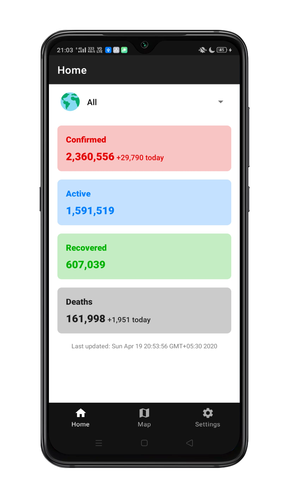
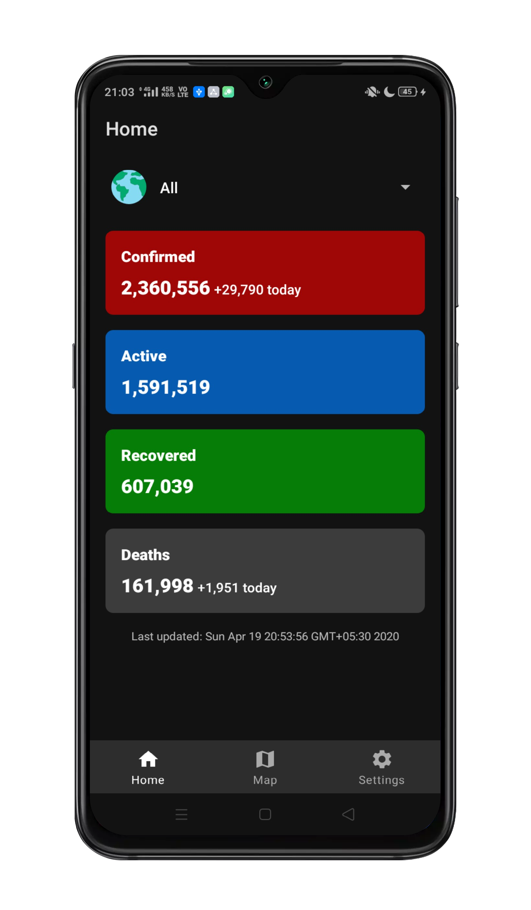
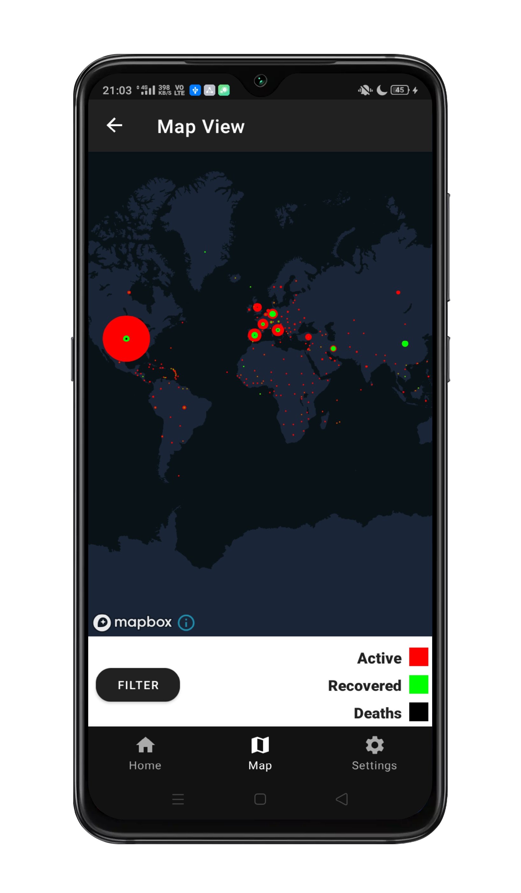
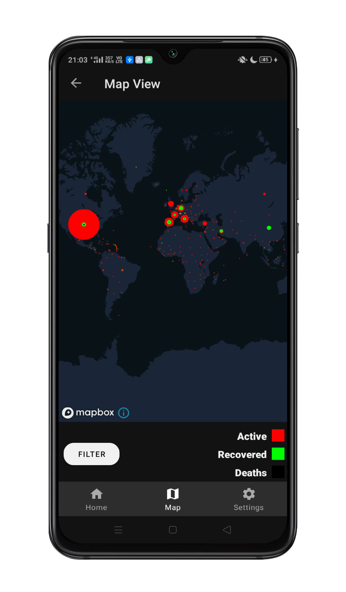
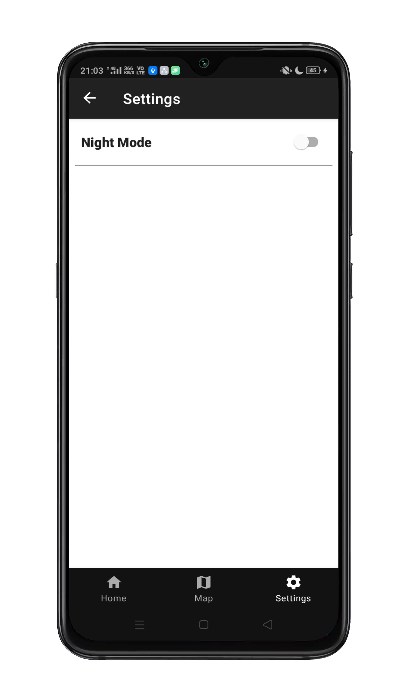
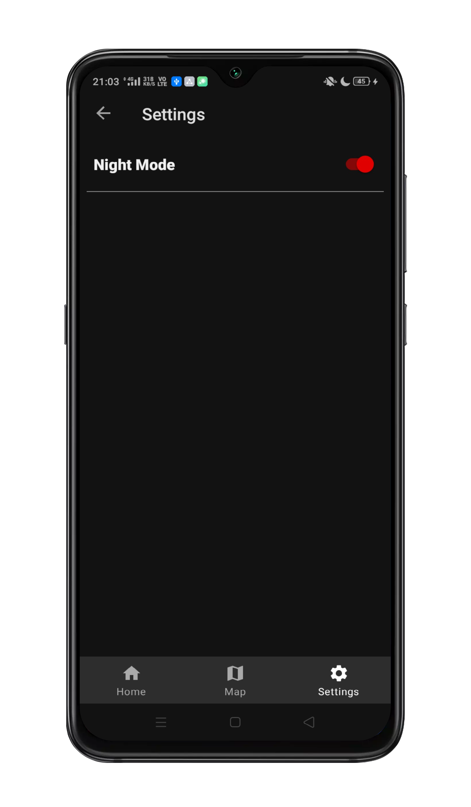

# Covid19-Tracker-Android
Covid19 Tracker Android App using MVVM architecture with Dark Mode

### Download
Get the latest APK from [here](https://github.com/ashar-7/Covid19-Tracker-Android/releases)

### Libraries used
* [ViewModel](https://developer.android.com/topic/libraries/architecture/viewmodel)
* [LiveData](https://developer.android.com/topic/libraries/architecture/livedata)
* [Navigation](https://developer.android.com/guide/navigation)
* [Retrofit](https://square.github.io/retrofit/) 
* [Glide](https://github.com/bumptech/glide)
* [Material Design](https://material.io/)
* [Mapbox](https://www.mapbox.com/)

### Data Source
* [NovelCovid API](https://corona.lmao.ninja/)

### Mapbox
* Get your [access token](https://docs.mapbox.com/android/maps/overview/#2-get-an-access-token) 
and put it in [strings.xml](/app/src/main/res/values/strings.xml).

* Copy the map to your account by visiting [this link](https://api.mapbox.com/styles/v1/ashar7/ck9314d9i168m1ioizsycq5b5.html?fresh=true&title=copy&access_token=pk.eyJ1IjoiYXNoYXI3IiwiYSI6ImNrOTc2bzhkeTBmY2kzZ3Rjd2Rxajg1OXUifQ.9_qVbFzRzsWEINf_FKsiIg)
while logged in to your mapbox account. Then copy your map URL and put it in [strings.xml](/app/src/main/res/values/strings.xml)
(I'm not sure if you can use my URL so better copy the map and put your own URL).

### Screenshots
 

 

 
